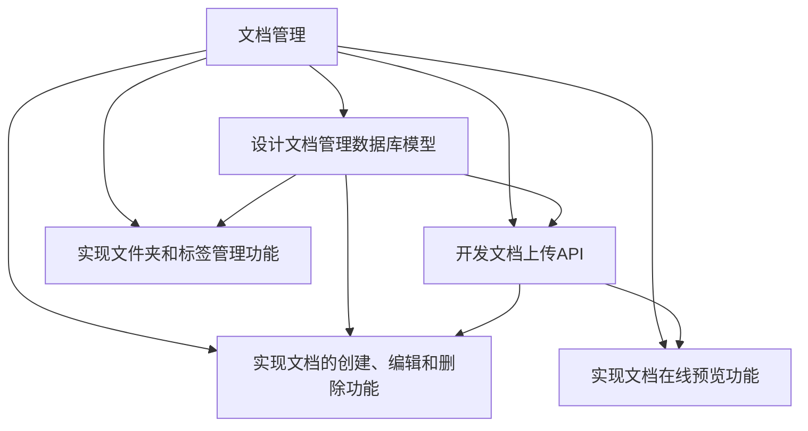

# 任务 '文档管理' 的子任务列表

## 父任务信息
- **ID**: 1
- **名称**: 文档管理
- **描述**: 构建文档管理模块，实现知识文档的创建、编辑、删除，支持文件夹或标签分类管理，支持 Word, PDF, Markdown 等格式文档上传，并提供文档在线预览功能。
- **优先级**: high

## 子任务列表 (5个)

| ID | 名称 | 优先级 | 估计工时 | 依赖任务 | 标签 |
|-----|-----|-----|-----|-----|-----|
| 1.1 | 设计文档管理数据库模型 | critical | 8 小时 | - | 数据库, 文档管理, 后端 |
| 1.2 | 开发文档上传API | critical | 24 小时 | 1.1 | API, 文档上传, 后端 |
| 1.3 | 实现文档的创建、编辑和删除功能 | high | 16 小时 | 1.1, 1.2 | 文档管理, CRUD, 后端 |
| 1.4 | 实现文件夹和标签管理功能 | high | 12 小时 | 1.1 | 分类管理, 标签, 前端 |
| 1.5 | 实现文档在线预览功能 | critical | 20 小时 | 1.2 | 在线预览, 前端, 文档处理 |
## 详细子任务信息

### 设计文档管理数据库模型
- **ID**: 1.1
- **优先级**: critical
- **状态**: todo
- **依赖任务**: 无
- **估计工时**: 8 小时
- **标签**: 数据库, 文档管理, 后端
- **描述**: 设计文档管理模块的数据库模型，包括文档表（存储文档元数据）、分类表（存储文件夹或标签信息）、文档与分类关系表等。需要考虑字段类型、索引设计以及与其他模块的关联关系，例如用户权限。

### 开发文档上传API
- **ID**: 1.2
- **优先级**: critical
- **状态**: todo
- **依赖任务**: 1.1
- **估计工时**: 24 小时
- **标签**: API, 文档上传, 后端
- **描述**: 开发文档上传API接口，支持Word, PDF, Markdown等多种格式。需要实现文件存储、格式转换（例如将Word转换为PDF或HTML以便在线预览）、元数据提取（例如标题、作者）等功能。同时需要考虑文件大小限制、上传速度优化以及安全性问题。

### 实现文档的创建、编辑和删除功能
- **ID**: 1.3
- **优先级**: high
- **状态**: todo
- **依赖任务**: 1.1, 1.2
- **估计工时**: 16 小时
- **标签**: 文档管理, CRUD, 后端
- **描述**: 实现文档的创建、编辑和删除功能。创建功能需要调用文档上传API，编辑功能需要支持在线编辑或下载编辑后重新上传，删除功能需要同时删除数据库记录和物理文件。需要考虑用户权限控制，确保只有授权用户才能进行相应操作。

### 实现文件夹和标签管理功能
- **ID**: 1.4
- **优先级**: high
- **状态**: todo
- **依赖任务**: 1.1
- **估计工时**: 12 小时
- **标签**: 分类管理, 标签, 前端
- **描述**: 实现文件夹和标签的创建、编辑、删除和管理功能。需要设计合理的分类体系，支持多级文件夹和多标签，并提供易于使用的界面进行分类管理。同时需要考虑分类的权限控制，确保只有授权用户才能创建、编辑或删除分类。

### 实现文档在线预览功能
- **ID**: 1.5
- **优先级**: critical
- **状态**: todo
- **依赖任务**: 1.2
- **估计工时**: 20 小时
- **标签**: 在线预览, 前端, 文档处理
- **描述**: 实现文档在线预览功能，支持Word, PDF, Markdown等多种格式。需要选择合适的在线预览组件或服务，并进行集成。对于Word和Markdown文档，可以转换为HTML进行预览；对于PDF文档，可以使用PDF.js等开源库进行预览。需要考虑预览的性能和安全性，例如防止恶意代码注入。

## 任务依赖关系

